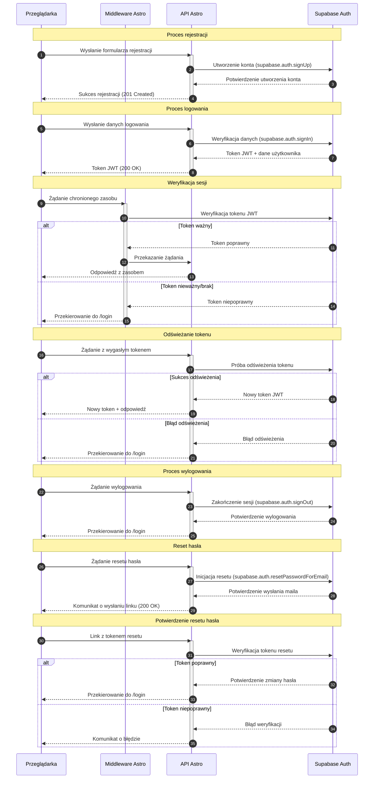

```mermaid
sequenceDiagram
    autonumber
    participant Browser as Przeglądarka
    participant Middleware as Middleware Astro
    participant API as API Astro
    participant Auth as Supabase Auth

    %% Rejestracja
    Note over Browser,Auth: Proces rejestracji
    Browser->>API: Wysłanie formularza rejestracji
    activate API
    API->>Auth: Utworzenie konta (supabase.auth.signUp)
    Auth-->>API: Potwierdzenie utworzenia konta
    API-->>Browser: Sukces rejestracji (201 Created)
    deactivate API

    %% Logowanie
    Note over Browser,Auth: Proces logowania
    Browser->>API: Wysłanie danych logowania
    activate API
    API->>Auth: Weryfikacja danych (supabase.auth.signIn)
    Auth-->>API: Token JWT + dane użytkownika
    API-->>Browser: Token JWT (200 OK)
    deactivate API

    %% Weryfikacja sesji
    Note over Browser,Auth: Weryfikacja sesji
    Browser->>Middleware: Żądanie chronionego zasobu
    activate Middleware
    Middleware->>Auth: Weryfikacja tokenu JWT
    alt Token ważny
        Auth-->>Middleware: Token poprawny
        Middleware->>API: Przekazanie żądania
        API-->>Browser: Odpowiedź z zasobem
    else Token nieważny/brak
        Auth-->>Middleware: Token niepoprawny
        Middleware-->>Browser: Przekierowanie do /login
    end
    deactivate Middleware

    %% Odświeżanie tokenu
    Note over Browser,Auth: Odświeżanie tokenu
    Browser->>API: Żądanie z wygasłym tokenem
    activate API
    API->>Auth: Próba odświeżenia tokenu
    alt Sukces odświeżenia
        Auth-->>API: Nowy token JWT
        API-->>Browser: Nowy token + odpowiedź
    else Błąd odświeżenia
        Auth-->>API: Błąd odświeżenia
        API-->>Browser: Przekierowanie do /login
    end
    deactivate API

    %% Wylogowanie
    Note over Browser,Auth: Proces wylogowania
    Browser->>API: Żądanie wylogowania
    activate API
    API->>Auth: Zakończenie sesji (supabase.auth.signOut)
    Auth-->>API: Potwierdzenie wylogowania
    API-->>Browser: Przekierowanie do /login
    deactivate API

    %% Reset hasła
    Note over Browser,Auth: Reset hasła
    Browser->>API: Żądanie resetu hasła
    activate API
    API->>Auth: Inicjacja resetu (supabase.auth.resetPasswordForEmail)
    Auth-->>API: Potwierdzenie wysłania maila
    API-->>Browser: Komunikat o wysłaniu linku (200 OK)
    deactivate API

    Note over Browser,Auth: Potwierdzenie resetu hasła
    Browser->>API: Link z tokenem resetu
    activate API
    API->>Auth: Weryfikacja tokenu resetu
    alt Token poprawny
        Auth-->>API: Potwierdzenie zmiany hasła
        API-->>Browser: Przekierowanie do /login
    else Token niepoprawny
        Auth-->>API: Błąd weryfikacji
        API-->>Browser: Komunikat o błędzie
    end
    deactivate API
```
